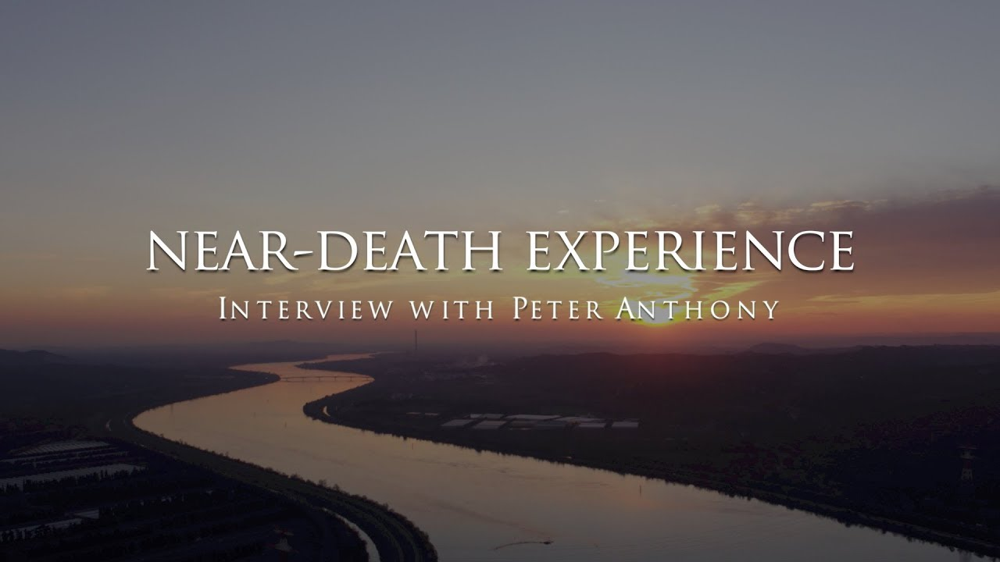

# Tarjeta de fuente — 5XrA79_T_R0

## Video

- Video: [The near-death experience of Peter Anthony](https://www.youtube.com/watch?v=5XrA79_T_R0)
- Video ID: `5XrA79_T_R0`

## Experienciador/a

- Experienciador/a: [Peter Anthony](http://www.theaccidentalprophet.com)
- Fuente de la imagen: fallback: video thumbnail; no separate verified portrait preserved yet

> Nota: para este caso todavía no hay retrato independiente verificado preservado localmente; se usa provisionalmente el thumbnail del video como imagen del experienciador hasta encontrar una fuente mejor.

## Canal / autor del video

- Canal/autor del video: [Anthony Chene production](https://www.youtube.com/@AnthonyCheneProduction)

## Uso editorial

Esta tarjeta separa el thumbnail del video, la foto de la persona que da el testimonio y el canal/autor que publicó el video. No debe confundirse el canal productor con el experienciador.
