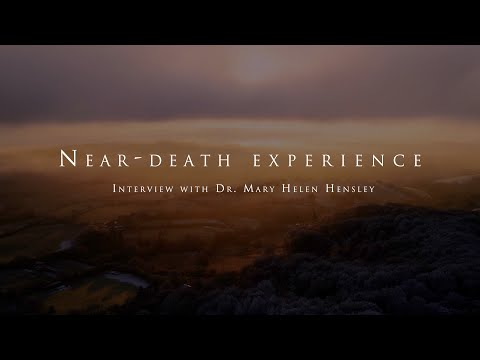
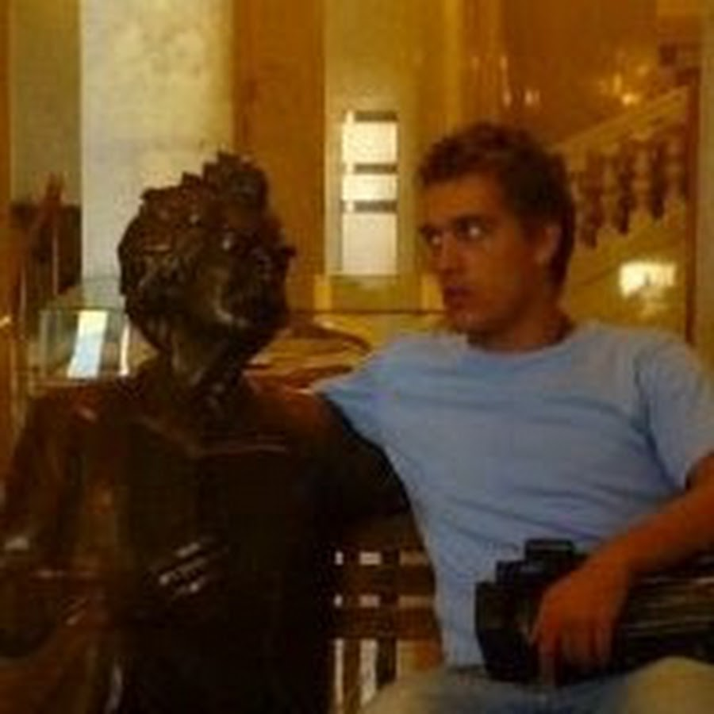

# Tarjeta de fuente — 6GsWknK5r-8

## Video

- Video: [The near death experience of Dr. Mary Helen Hensley](https://www.youtube.com/watch?v=6GsWknK5r-8)
- Video ID: `6GsWknK5r-8`

## Experienciador/a

- Experienciador/a: [Dr. Mary Helen Hensley](https://www.maryhelenhensley.com/)
- Fuente de la imagen: Mary Helen Hensley author/about page

## Canal / autor del video

- Canal/autor del video: [Anthony Chene production](https://www.youtube.com/c/AnthonyCheneproduction)

## Uso editorial

Esta tarjeta separa el thumbnail del video, la foto de la persona que da el testimonio y el canal/autor que publicó el video.
