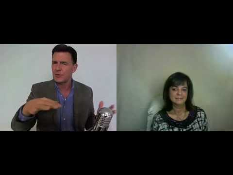
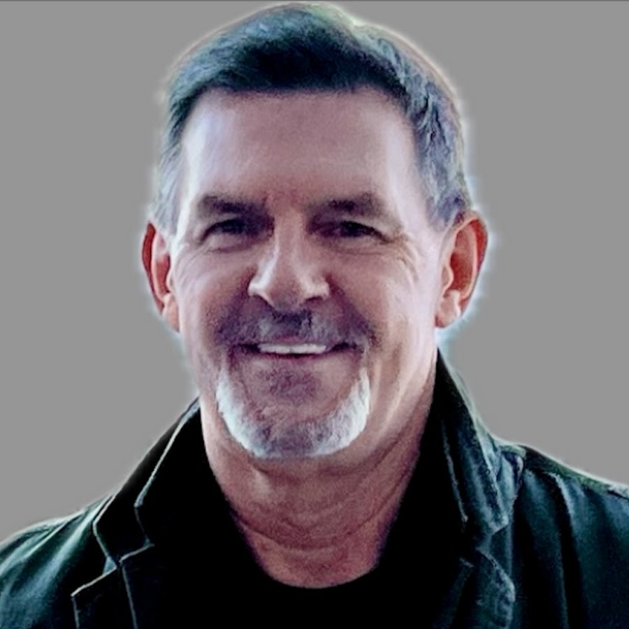

# Tarjeta de fuente — 87TRYkP2zBM

## Video

- Video: [Anita Moorjani's Near-Death Experience While Dying Of Cancer - Author of Dying To Be Me](https://www.youtube.com/watch?v=87TRYkP2zBM)
- Video ID: `87TRYkP2zBM`

## Experienciador/a

- Experienciador/a: [Anita Moorjani](https://www.anitamoorjani.com/)
- Fuente de la imagen: BATGAP interview profile photo

## Canal / autor del video

- Canal/autor del video: [Afterlife TV with Bob Olson](https://www.youtube.com/user/AfterlifeTVChannel)

## Uso editorial

Esta tarjeta separa el thumbnail del video, la foto de la persona que da el testimonio y el canal/autor que publicó el video.
