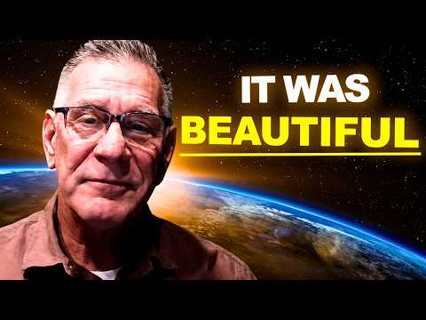
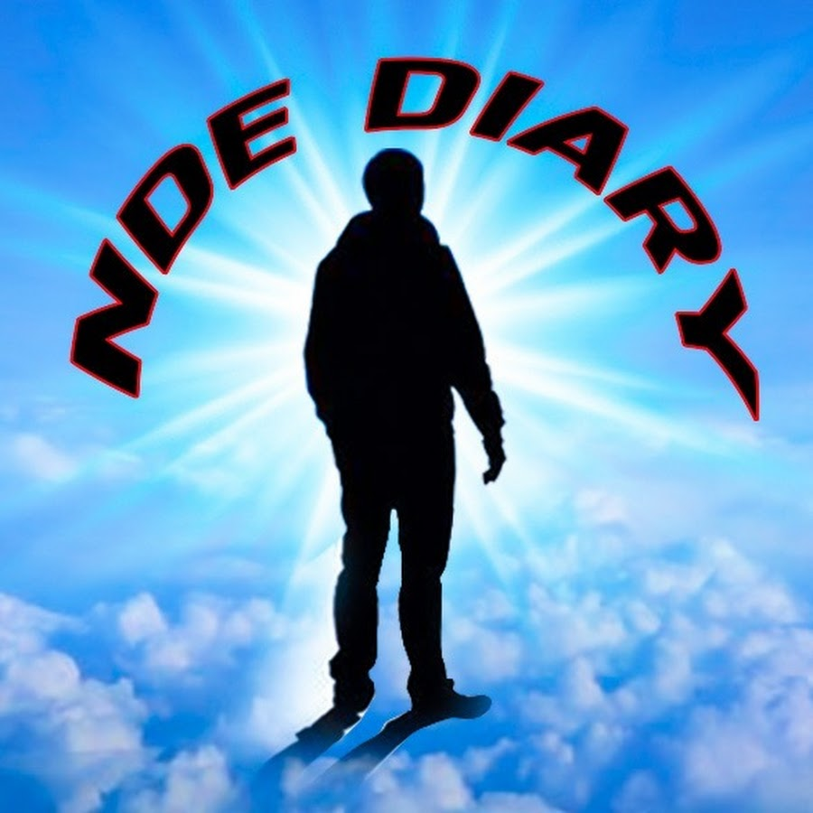

# Tarjeta de fuente — nwGdu4GiHhY

## Video

- Video: [I Died of a Heart Attack For 20 Minutes & What I Heard Changed EVERYTHING!](https://www.youtube.com/watch?v=nwGdu4GiHhY)
- Video ID: `nwGdu4GiHhY`

## Experienciador/a

- Experienciador/a: [Kevin Mohatt](https://www.amazon.com/Not-Yet-Tomorrow-Just-Begun/dp/B0GS1DYZP4)
- Fuente de la imagen: fallback: video thumbnail; no separate verified portrait found yet

> Nota: para este caso todavía no hay retrato independiente verificado; se usa provisionalmente el thumbnail del video como imagen del experienciador hasta encontrar una fuente mejor.

## Canal / autor del video

- Canal/autor del video: [NDE Diaries](https://www.youtube.com/@ndediary)

## Uso editorial

Esta tarjeta separa el thumbnail del video, la foto de la persona que da el testimonio y el canal/autor que publicó el video.
