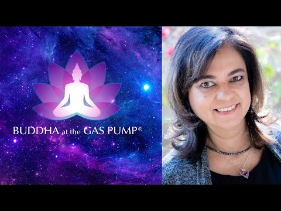

# Fuente YouTube — vmuOXgr5UZw

Video: [152. Anita Moorjani - Buddha at the Gas Pump](https://www.youtube.com/watch?v=vmuOXgr5UZw)

## Tarjeta visual

- Video: [152. Anita Moorjani - Buddha at the Gas Pump](https://www.youtube.com/watch?v=vmuOXgr5UZw)
- Canal/autor del video: [Buddha at the Gas Pump®](https://www.youtube.com/channel/UCnlVpm_PkNiFlTWFb0sEUDg)

- Experienciador/a: [Anita Moorjani](https://www.anitamoorjani.com/)
- Fuente de la imagen: BATGAP interview profile photo
- Tarjeta completa: [[source-card]]

## Capas de transcripción

- `metadata.json`
  Metadata seleccionada de la página BATGAP/YouTube y estado de ingesta.

- `transcript_batgap_raw.json` / `transcript_batgap_raw.md`
  Transcripción pública de BATGAP preservada sin corrección editorial como capa raw disponible.

- `transcript_readable.md`
  Versión legible provisional basada en BATGAP, con capítulos/timestamps de navegación hacia YouTube.

## Estado

- Ingresado: 2026-06-23
- Estado: transcrito desde fuente pública BATGAP
- Canal/programa: Buddha at the Gas Pump
- Experienciadora: Anita Moorjani
- Nota técnica: la extracción directa de contenido YouTube falló en este entorno; no se creó `transcript_youtube_raw.*`.
